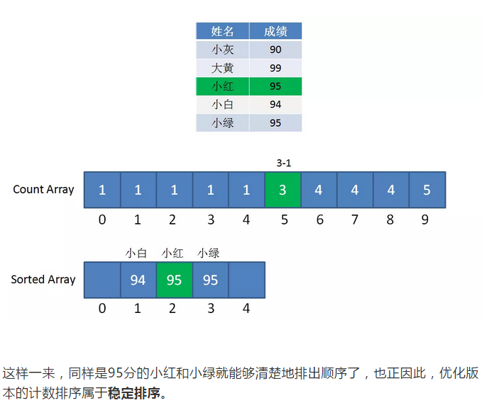

# BasicsAlgorithms

> 十大经典基本排序

## 非线性时间比较类排序

### 交换排序、

#### [冒泡排序(Bubble-Sort)](./HTML/Bubble-Sort.html)

概要/结论：原始的冒泡排序是**稳定排序**。由于该排序算法的每一轮要遍历所有元素，轮转的次数和元素数量相当，所以时间复杂度是O（N2） 。

思路：相邻的元素两两比较，根据大小来交换元素的位置。每个元素都像小泡一样向[特定的一侧移动];

优化：

1. 记录是否有位置交换，提早结束。（大数向右，小数向左，如果无交换可证明左侧均为有序）；

2. 记录最后一个交换位置（因为冒泡的原理，所以交换处往后的都是有序的。

3. 鸡尾酒排序：是冒泡排序的双向比较过程，2个位置2个边界，先向右冒泡，再向左冒泡。（减少排序回合，适用于大部分已经排好序的数组。）

#### [快速排序(DualPivotQuick-Sort)](./HTML/DualPivotQuick-Sort.html)

**基本思想：** 通过一趟排序将要排序的数据分割成独立的两部分：**分割点左边都是比它小的数，右边都是比他大的数。**

**思路：**定2个基数，右向左扫描，通过偏移right指针，找寻比基准数小的元素。找到后赋值给left指针。反之，left偏移，找到比基数大的元素，将其赋值给right；重复寻找直到left、right指针重合。最后以基准数为分割点，对其左右两侧分别递归上述逻辑。

**时间复杂度：**数据有序，基数在一侧边缘，另一侧为空，此时执行效率最差。O(N2)，而数据越随机，快速排序性能越好。数据越有序，性能越差，

**空间复杂度：**快速排序在每次分割的过程中，需要 1 个空间存储基准值。而快速排序的大概需要 Nlog2N次的分割处理，所以占用空间也是 Nlog2N 个。

**稳定性：**在快速排序中，相等元素可能会因为分区而交换顺序，所以它是不稳定的算法。

### 插入排序

#### [直接插入排序(insertSort)](./HTML/insertSort.html)

**思想：**每次将一个新数据插入到有序队列中的合适位置里。

**思路：**外部循环扫描未排序的进行每一个排序。内部循环扫描已经排好序的，进行插入。

**时间复杂度：**正序：O（N）。反序：O（N2）。越接近正序，效率越好。

**空间复杂度：**每次一个临时变量所以为1.

**稳定性：**直接插入排序，不需要改变相等数值元素的位置。（稳定）

#### [希尔排序(shellSort)](./HTML/shellSort.html)

> （缩小增量排序）（不稳定）（主要是步长的问题）
>
> （直接插入的威力加强）（直接插入排序120W都动不了 ）

**要点1：**步长的选择是希尔排序的重要部分。只要最终步长为1任何步长序列都可以 工作。

**要点2：**他是直接插入排序的加强版，面对的主要问题是步长的问题。

**思想：**把记录按步长gap分组，对每组记录采用直接插入排序方法进行排序。随着步长减小，所分成包含的记录越来越多，当步长的值减小到1时，整个数据合成为一组，构成一组有序记录。（最后一步是简单插入排序）

**时间复杂度：**

### 选择排序

#### [简单选择排序(simpleSelectSort)](./HTML/simpleSelectSort.html)

**思想：**每趟从待排序的记录中选出关键最小的记录，顺序放在已排序的记录序列末尾，知道全部排序结束为止。

**思路：**1、从待排序中，找到关键字最小的元素；2、如果最小元素不是待排序序列的第一个元素，将其和第一个元素互换。3、选择下一个元素，重复1、2操作。

**时间复杂度：**简单选择排序的比较次数与序列的初始化排序无关。假设待排序的序列有N个元素，则比较次数总是N(N-1)/2；①当正序的时候移动最少，为0。当序列反序时，移动次数最多，为3N(N-1)/2;，综上所述，时间复杂度为O(N2);

**空间复杂：**简单选择排序需要占用1个临时空间，在交换数值时候使用。N（1）

#### 二叉堆的理解

> 图片来自某公众号

二叉堆本质上是一种完全二叉树，它分为两个类型：

1. 设当前元素在数组中以R[i]表示，那么，

   1.  它的左孩子结点是：R[2*i+1];*
   2. 它的右孩子结点是：R[2*i+2];
   3.  它的父结点是：R[(i-1)/2];
   4. R[i] <= R[2*i+1] 且 R[i] <= R[2i+2]。

2.   最大堆：最大堆任何一个父节点的值，都大于等于它左右孩子节点的值。

   Ri >= R2i+1 且 Ri >= R2i+2 (大根堆)

3. 最小堆：最小堆任何一个父节点的值，都小于等于它左右孩子节点的值。

   Ri <= R2i+1 且 Ri <= R2i+2 (小根堆)

4. 二叉堆的根节点叫做堆顶。

**插入节点：**二叉堆的节点插入，插入的位置是完全二叉树的最后一个位置。如插入一个0

这时候，我们让节点0和父节点6比较，如果0小于5，则让新节点“上浮”

继续比较0和3，如果0小于3，则让新节点继续“上浮”，最终0上浮到堆顶位置。

**删除节点：**二叉堆的节点删除过程和插入过程正好相反，所删除的是处于堆顶的节点，比如我们删除最小堆的堆顶节点1

这时候为了维持完全二叉树的结构，我们把堆的最后一个节点10补到原本堆顶的位置。

接下来我们移动到堆顶的节点10和它的左右孩子进行比较，如果左右孩子中最小的一个比节点10小，那么节点10“下沉”。

**继续比较**

**构建二叉堆：**构建二叉堆，也就是把一个无序的完全二叉树调整为二叉堆，本质上就是让所有非叶子节点依次下沉。

首先，我们从最后一个非叶子节点开始，也就是从节点10开始。如果节点10大于它左右孩子中最小的一个，则节点10下沉。

接下来轮到节点3，如果节点3大于它左右孩子中最小的一个，则节点3下沉。

接下来轮到节点1，如果节点1大于它左右孩子中最小的一个，则节点1下沉。事实上节点1小于它的左右孩子，所以不用改变。

接下来轮到节点7，如果节点7大于它左右孩子中最小的一个，则节点7下沉。

这样就是，一颗无序的完全二叉树就构建成了一个最小堆。

#### [堆排序(二叉堆排序)(binary-Sort)](./HTML/binary-Sort.html)

> 堆是一棵顺序储存的完全二叉树。

**理解：**

其中每个节点的关键子都不大于其孩子节点的关键子，这样的堆称为小根堆。

（1）Ri<=R2i+1且Ri<=R2i+2（小根堆）

其中每个节点的关键字都不小于其孩子结点的关键字，这样的堆称为大根堆。

（1）Ri>=R2i+1且Ri>=R2i+2（大根堆）

它的父结点是R[(i-1)/2]; R[i] <= R[2*i+1] 且 R[i] <= R[2i+2]。

**操作：**1、根据初始数组去构造初始堆（构建一个完全二叉树，保证所有的父节点都比它的孩子节点的数值大）.2、每次交换第一个和最后一个元素，输出最后一个元素（最大值），然后把剩下元素重新调整为大根堆。

**时间复杂度：**堆的储存表示是顺序的，因为堆所对应的二叉树为完全二叉树，而完全二叉树通常采用顺序储存方式。当想得到一个序列中第k个最小的元素之前的部分排序序列，最好采用堆排序。因为堆排序的时间复杂度是O（n+klog2n），若k<=n/log2n,则可以得到的时间复杂度为O（n）；

**算法稳定性：**因为在调整过程中，关键字进行比较和交换所走的是该节点到叶子节点一条路径，因此对于相同的关键子就可以出现排在后面的关键字交换到前面来的情况。（不稳定）

### [归并排序(twoMergeSort)](./HTML/twoMergeSort.html)

> 二路归并

**概念：**归并排序是建立在归并操作上的一种有效的排序算法，该算法是采用**分治法（Divide and Conquer）**的一个非常典型的应用。

​	归并排序是建立在归并操作上的一种有效的排序算法，该算法是采用分治法的一个非常典型的应用。将已有序的子序列合并，得到完全有序的序列，再使子序列段间有序。若将两个有序表合并成一个有序表，成为**二路归并**。

**思想：**将待排序序列R[0-n-1]看成是n个长度为1的有序序列，将相邻的有序表成对归并，得到n/2个长度为2的有序表；将这些有序列表再次归并，得到n/4个长度为4的有序序列；如此反复进行下去，最后得到一个长度为N的有序序列。

**思路：**

1. “分解”-将序列每次**拆分划分；**

2. “合并”—将划分后的序列段两两合并后排序。在每次合并过程中，都是对两个有序的序列段进行合并，然后排序。这两个有序序列段分别为R[low,mid]和R[mid+1,high]。先将他们合并到一个局部的暂存数组R2中，带合并完成后再将R2复制会回R中。

   在某趟归并中，设各子表的长度为gap，则归并前R[0…n-1]中共有n/gap个有序的子表：

   R[0…gap-1], R[gap…2gap-1],… , R[(n/gap)gap … n-1]。调用Merge将相邻的子表归并时，必须对表的特殊情况进行特殊处理。

​	若子表个数为奇数，则最后一个子表无须和其他子表归并（即本趟处理轮空）：若子表个数为偶数，则要注意到最后一对子表中后一个子表区间的上限为n-1。

**时间复杂度：**归并排序的形式就是一颗二叉树，他需要遍历的次数就是二叉树的深度，而根据完全二叉树的可以得出他的时间复杂度是0（n*log2N）

**空间复杂度：**算法处理过程中，需要一个大小为n的临时储存空间，用以保存合并序列。

**稳定性：**在归并排序中，相等的元素的顺序不会改变，所以他是稳定的算法。

**比较：**归并排序，堆排序，快速排序比较；

**从空间复杂度考虑：**首选堆排序，其次是快速排序，最后是归并排序。

**从稳定性来考虑：**应选取归并排序，因为堆排序和快速排序都是不稳定的。

**从平均情况考虑**，应选择快速排序。

## 线性时间非比较类排序

### [计数排序(countSort)](./HTML/countSort.html)

思路和概念：在一定的整数范围中，性能更快更优，1、遍历数组找出最大最小和差值以及确认偏移值，判断是否适合计数排序。2、遍历数组对号入座就行。3、如果需要稳定排序则需要改变：统计数组从第二个元素开始，每一个元素都加上前面所有元素之和。这样相加的目的，是让统计数组存储的元素值，等于相应整数的最终排序位置。比如下标是9的元素值为5，代表原始数列的整数9，最终的排序是在第5位。

俗气版：

1. 满足应用条件：数据区间小且整数；（90-110间整数排序）
2. 可以通过在每一步统计的时候，每个元素加上前面所有元素之和。

> 图解（来源某公众号）

**时间复杂度：总体运算量是3N+M，所以时间复杂度是o（N+M）**

**空间复杂度：不考虑结果数组，只考虑统计计数组大小的话，空间复杂度是O（M）**

**局限：1、当数列最大最小值差距过大时候或当元素不是整数时，并不适用计数排序**

### [桶排序(bucketSort)](./HTML/bucketSort.html)

**思想：**所谓的桶代表一个区间范围。桶用来承载一个或者多个元素。归纳元素后，桶内排序好然后合并成有序的数组。

**思路：**

1. 确定区间跨度和桶的数量。
2. 遍历原始数列，把元素放入各个桶中。
3. 排序每个桶。最后合并输出排序结果。

**定位元素属于哪个桶：**（arr[i] – min）* (bucketNum-1)/d

**时间复杂度：**数列有n个元素，分成m个桶，设每个桶的元素个数为n/m。

1. 区间边界值，运算量为n。空桶为m。遍历原始数组为n。
2.  排序每个桶内部，由于使用了O（nlogn）的排序算法，所以运算量为n/m*log(n/m)*m
3.  输出排序数列，运算量为n；所以总数为：3n+m+ n/m * log(n/m ) * m = 3n+m+n(logn-logm)
4.  总结去N得出：O(n+m+n(logn-logm)）
5.  在理想情况下，桶中的元素分布均匀时，当n=m时，时间复杂度可以达到o（n）
6.  在极端情况下第一个桶有n-1个元素，最后一个桶有1个元素，此时的时间复杂度将退化为o（nlogn），还有很多空桶；

**空间复杂度：**空桶占用的空间 + 数列在桶中占用的空间 = O（m+n）。

### 基数排序

  基数排序是按照低位先排序，然后收集；再按照高位排序，然后再收集；依次类推，直到最高位。有时候有些属性是有优先级顺序的，先按低优先级排序，再按高优先级排序。最后的次序就是高优先级高的在前，高优先级相同的低优先级高的在前；

**思路：**

1. 取得数组中的最大数，并取得位数；

2. arr为原始数组，从最低位开始取每个位组成radix数组；

3. 对radix进行计数排序（利用技术排序适用于小范围数的特点）