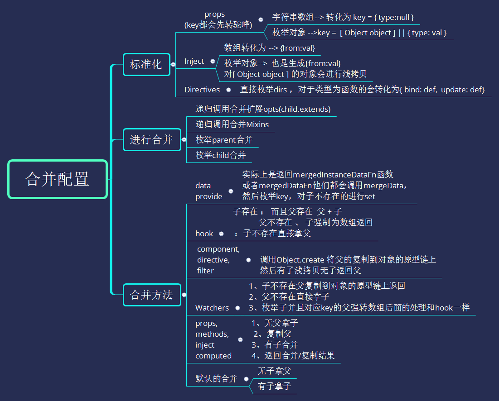

> mergeOptions实际上不是一个很难的模块、但是我们平时使用vue编写与其接触最多最近的就是该模块、所以就把其复杂化让流程跑得更通更远，细心的慢慢的单步调试，你会更懂Vue。

> 有一些没有触发或者之前提及的都跳过或者省略了。

#### 简单图片说明



# 合并配置

配置的合并策略比较简单大概分为以下几点：

1. 标准化 props、Inject、Directives
   - props --> array
   - 循环数组 --> 标准化key 和 res[name] = { type: null }
   - props --> obj
   - 枚举obj --> 标准化key --> val是Obj就返回不是的 返回 { type: val }
   - props --> 都不是报错
   - Inject -->  array --> 将数组改为形如{from:val} 的对象
   - Inject -->  obj -->  return val  isObj ? extend({ from: key }, val) : { from: val }
   - Inject --> 都不是报错
   - Directives --> 枚举 --> def = dirs[key]如果是一个函数dirs[key] = { bind: def, update: def }
2. 如果child有继承的属性那么就递归调用mergeOptions进行合并，并赋值到parent
3. 如果child有mixins 循环数组调用mergeOptions进行合并，并赋值到parent
4. 枚举parent 、child 执行不同的key的函数合并策略，合并到options上并返回：如下
5. component、directive、filter --> 先在res的原型上创建父的属性、方法  --> 有child浅拷贝无child直接返回。
6. provide、data 合并
   - 调用mergeDataOrFn进行合并
   - 判断完vm、child、parent后调用mergeData进行合并
   - 枚举from -->  !hasOwn(to, key) --> 设置响应式 --> 否则如果toVal、fromVal都是Obj -->  递归mergeData合并
7. props、methods、inject、computed --> 实际上 就是复制child和parent的属性
8. 钩子函数 --> mergeHook --> 子父存在相加  | 父不存在 、子强制为数组返回
9. watch
   - 进行 nativeWatch、child、parent的检测
   - 检测通过 --> 拷贝parent
   - 枚举子 -->  有父转数组 --> 再和子合并或者将子转化为数组
   - 返回结果
10. 未知选项 --> defaultStrat --> 有子拿子、无子拿父。

## 例子（通过理解mergeOpts来提高一下例子的复杂度）

```html
<div id="app"></div>

  <script>
    window.onload = function() {
     /* 可能写得有点复杂亲，请细细阅读
      * 运行流程的理解
      * 1、首次渲染触发 child 的一个demo的指令
      * 2、1秒后触发parent.method.consoleHe 但由于sayHe是provide属性（类似angular的依赖注入）
      *    并不会触发watch（注入的属性不可观察）和视图的渲染
      * 3、3秒后触发 this.age++; age属性改变了触发child和children的更新和age[props]的重新验证
      *   watch.age检测到变化处罚watch
      *   触发指令demo
      *   触发watch
      *   children updated（调用createElm渲染是子到父的【递归】）
      *   child updated
      */
      const localMixin = {
        created() {
          console.log('local created');
        }
      }
      const children = {
        name: 'children',
        props: {
          // 检测类型
          height: Number,
          // 检测类型 + 其他验证
          age: {
            type: Number,
            default: 0,
            required: true,
            validator: function (value) {
              return value >= 0 // 有验证规则，虽然报错数据也能传输、但会报错
            }
          }
        },
        watch: {
          age: function (val, oldVal) {
            console.log('我： %s 岁, 长大到了 %s岁,验证通过不报错了~！', oldVal, val);
          },
        },
        updated() {
          console.log('children updated');
        },
        template: `
        <div>
          <p>我是子子组件</p>
          来自子组件的数据：age = {{ age }} , height = {{ height }}
        </div>
        `
      }
      const child = {
        name: 'child',
        directives: {
          demo:  function (el, binding) {
            console.log(binding.value.color) // => "white"
            console.log(binding.value.text)  // => "hello!"
          }
        },
        data() {
          return {
            // 有类型检查不用bind或者不用:进行绑定传过去默认为字符串
            height: 222,
            age: -1, // 让数据报错
          }
        },
        inject: ['sayHe'],
        props: [ 'emitMsg' ], //　不进行类型检查所有都收 //JSON直接渲染了
        mixins: [ localMixin ],
        mounted() {
          setTimeout(() => {
            console.log('3秒了长大了~!');
            this.age++;
          },3000)
        },
        updated() {
          console.log('child updated');
        },
        template: `
        <div  v-demo="{ color: 'white', text: 'hello!' }">
          <p>{{ sayHe }}</p>
          <p>我是子组件  <span class="color-red">{{ emitMsg }}</span></p>
          <children :age="age" :height="222" />
        </div>
        `,
        components: { children }
      }
      const vm = new Vue({
        el: '#app',
        data() {
          return {
            msg: {　sendMsg:'我是来自父组件数据'}
          }
        },
        updated() {
          console.log('parent updated');
        },
        components: { // 局部注册
          child
        },
        provide: {
          sayHe: 'He ~'
        },
        methods: {
          consoleHe: function() {
            this.sayHe = '我改变了provide.sayHe 的数据但是数据不会响应,所以watch也不会执行。';
          }
        },
        watch: {
          sayHe: function() { // 不会出发的
            console.log('sayHe改变了: %s',this.sayHe);
          }
        },
        mounted() {
          setTimeout(() => {
            console.log('1秒开始改变~!');
            this.consoleHe()
          },1000)
        },
        template: `
        <div>
          我是父级
          <child :emit-msg="msg" />
        </div>
        `,
      });
    }
  </script>
```


# 理解

> 在知道代码的运行逻辑后 我们进入单步合并配置的理解

## new Vue 进入mergeOptions（parent，child，vm）

> parent：Vue下的静态选项（component、directives、filters）
>
> child：传入的options
>
> vm：当前实例

1. **无props、inject、directives标准化不执行**

2. **_base不存在，但是extends、mixins也不存在不执行**

3. 枚举parent -->

   - components --> 调用 mergeAssets 进行merge
     - Object.create() 复制一份到 res 的原型链上
     - 存在child，验证是否为[Object Object]\(验证不通过报错)、通过extend进行浅拷贝
     - 返回res
   - filters、directives 同上
   - _base --> defaultStrat --> 有子拿子，无子拿父

4. 枚举 child -->

   - **data、provide**
     - 调用mergeDataOrFn --> 进行3个参数的存在性区分。核心是调用mergeData -->
       - 返回一个函数 **mergedInstanceDataFn** -->
       - childVal 为函数就调用赋值 否则就直接赋值、parendVal 处理相同
       - 如果childVal存在则进行mergeData 返回 或者返回 parentVal -->**mergeData**
         - 遍历from的key --> 如果该属性不存在child中那么就调用set
         - 是一个obj就mergeData
         - 最后返回to
       - （这个比较绕比较重要所以先提及一下）
   - updated 、mounted --> 是钩子函数调用的是 mergeHook -->
     - 首次实例parent都不存在，而且是一个函数所以转化为数组然后返回。
   - methods、watch -->
     - 相关验证完后 、 parent不存在直接返回child

   - el、template --> defaultStrat --> 有子拿子，无子拿父

5. 返回new Vue merge的opts

### 接着往下走 来到initState

1. methods 存在initMethods --> 经过一系列的验证，把方法绑定到当前vm实例上
2. initData --> data 为是一个函数 --> 调用getData --> 返回结果复制到 vm._data上
   - getData -->
     - 禁用依赖收集pushTarget
     - 调用data，获取data
     - 开启依赖收集popTarget
   - 验证data和methods和props使用有冲突
   -  proxy(vm, "_data", key); 进行代理data访问  。 访问vm.data = vm.\_data 。
   - 调用observe 对data进行观察其变化（后面详解）
3. initWatch -->
   - 枚举watch --> 数组就遍历调用createWatcher、不是就直接调用createWatcher
   - createWatcher -->
     - handler为对象 --> opts = handler 、 handler = handler.handler
     - handler为string --> handler = vm[hanler]
     - 返回 vm.$watch（expOrFn , handler ,options）的结果
       - 实际是new Watcher 进行监听
       - 返回的是取消监听的函数

### 接着往下走 来到initProvide

1. mergedInstanceDataFn -->  调用函数反回值赋值给vm._provide
2. 同样的执行 ， 此次childVal是一个Obj 直接赋值 然后调用--> mergeData -->
3. from 不存在直接返回to

### 跳过一些流程

1. 调用不同阶段的钩子
2. $mount --> --getTemplate --> compileToFunctions --> mountComponent
3. befortMount
4. new Watcher --> get() --> _render()  -> _c()  --> createElement()
5. _createElement() --> createComponent() --> Vue.extend(Vue.opts,childOpts)  --> mergeOptions

## child组件的mergeOptions

1.  normalizeProps  props =[ 'emitMsg' ]
   - Array.isArray(props) --> 循环数组 --> name = camelize(val)（横线命名转驼峰）
   - res[name] = { type: null }
   - options.props = res;
2. normalizeInject inject = [ 'sayHe' ]
   - Array.isArray(inject) --> options.inject[inject[i]] = {from: inject[i] }
3. normalizeDirectives
   - 枚举 options.directives -->  传入项为func
   - options.directives[key] = { bind: val , update: val }
4. 这次mixins有定义 循环mixins数组 调用 mergeOptions（parent，child.mixins[i],vm）
   1. 这次merge比较简单在child的枚举中调用 mergeHook  对 created 钩子进行处理 （处理同上钩子理解）
   2. parent多了一个created的属性(一个装着所有**created钩子的数组**)
   3. **由此可得到mixins的属性方法会比其他先执行**
5. 枚举parent、child进行options的组装（类同的逻辑直接简单描述）
   - components、name、template、mixins、_Ctor --> 走defaultStrat（）逻辑
   - directives --> 走mergeAssets（）逻辑
   - updated钩子函数 --> mergeHook --> 父存在子不存在，直接拿子
   - mounted钩子函数 --> 和之前一样把钩子函数放到数组里面返回
     - 但如果钩子函数是存在的则相加起来
   - data --> 调用mergeDataOrFn  （同上）
   - inject、props --> 同上
     1. 无父拿子
     2. 复制父
     3. 有子合并
     4. 返回合并/复制结果


### 完成mergeOptions接着跳过一些流程

1. 调用extend后拿到继承后的构造函数
2. resolveConstructorOptions（因为是通过Vue.extend静态方法实例的所以有super）
   - resolveConstructorOptions（Ctor.supper）递归拿到所有父级的options
   - 缓存的cachedSuperOptions == SuperOptions
   - 返回options
3. extractPropsFromVNodeData解析传入的props进行原始值的提取
   1. hyphenate --> 驼峰转‘-’形式的字段 --> key 检查
   2. checkProp --> 对应正确的key获取属性以及删除或者保留该值
4. installComponentHooks --> 循环安装组件的钩子函数（"init"，"prepatch"，"insert"，"destroy"）
5. new VNode（组件vnode） 并且返回vnode
6. render继续执行解析文本节点 --> 解析最外层的div
7. **从外到里解析 然后再从里到外返回 终于解析完render 开始 调用_update 渲染DOM**
8. _updata() --> path() -->  createElm()--> createChildren()
9. 在创建第二个children的时候因为是组件所以会调用createComponent -->
10. 调用组件内置的init钩子 --> createComponentInstanceForVnode  --> 创建组件实例VNode -->
11. 最终来到了 vm._init 初始化 --> initInternalComponent -->
    - 拿到_parentVnode (vnode实例、父占位符节点) 、拿到 parent （Vue实例）
    - 只有propsData 拿到并赋值
12. 初始化注入（initInjections） --> 关闭监听 --> 定义语法糖（defineReactive）
13. **initData**
14.  --> initProps  --> 关闭观察 --> 枚举opts.props 调用 validateProp（） 检查可用性以及设置数据代理 --> 开启观察
15. --> initData --> 和上述差不多掠过
16. 调用$mount --> 和上述的大概流程差不多接着跳 --> (来到了最后一个_.c --> 创建children  Comp)
17. _createElement() --> createComponent() --> Vue.extend(Vue.opts,childOpts)  --> mergeOptions

## 终于来到了最后一个组件的mergeOptions（children组件）

1. normalizeProps （此时props是一个[Object Object]标准Obj） --> 枚举Obj -->
   - key = 'height'  && 不是一个存的Obj  --> res['height'] = { type: val }
   - key = 'age' && 是一个Obj --> res['age'] = val
2. 同样的枚举parent储存components、filters、directives、_base
3. name、template、_Ctor -->defaultStrat
4. props、 --> 同上
   1. 无父拿子
   2. 复制父
   3. 有子合并
   4. 返回合并/复制结果
5. updated钩子函数 --> mergeHook --> 父存在子不存在，直接拿子
6. watch -->相关验证完后 、 parent不存在直接返回child

## 后面的步骤也差不多了

# 总结

​	准备使用一个思维导图来总结一下后面补上