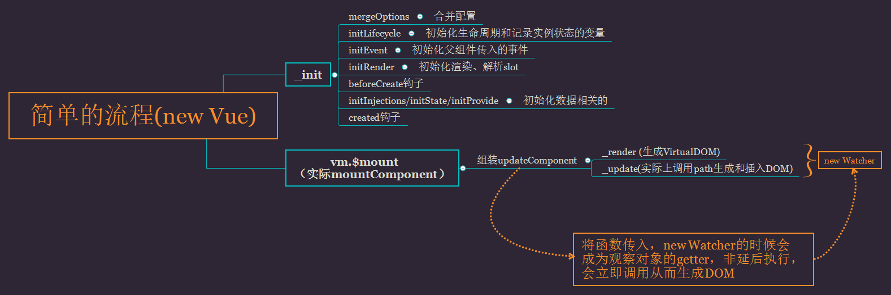

#### 简单图片说明




# Vue的数据驱动到渲染

# 简单的Vue的创建

```html
<div id="app">
    <span class="color-red">
      {{ msg }}
    </span>
  </div>

  <script>
    window.onload = function() {
      new Vue({
        el: '#app',
        mounted() {
          console.log(this.message); // 代理访问的证明
          console.log(this._data.message);
        },
        data() {
          return {
            msg: 'hello V',
            message: 'master'
          }
        },
      });
    }
  </script>
```

## 1、_init

1. 记录唯一uid、记录vue实例为true
2. mergeOptions
3. set  renderProxy
4. initLifecycle(vm) // 初始化生命周期钩子
5.  initEvents(vm) // 初始化事件中心 // 初始化事件中心实际复制父组件事件
6. initRender(vm) // 初始化渲染
7. callHook(vm, 'beforeCreate')
8. initInjections(vm) // resolve injections before data/props解决注入问题
9. initState(vm)//初始化数据中心 data、props、computed、watcher 等等。
10.  initProvide(vm) // resolve provide after data/props// 解决后提供的数据/道具？？ // 难道是针对函数形式的么？
11. callHook(vm, 'created')
12. if（el） vm.$mount(el)

## 2、mergeOptions

1. resolveConstructorOptions  // Cotr: 在第一次new Vue的时候传入的是Vue Class // 显然没有父级-->直接返回Vue
2. parent --> 就是第一的结果
3. child --> new 时候传入的 opts
4. vm  --> new Vue
5. 标准化（props、inject、directives）//显然这里不需要执行
6. 不是Vue或者组件（!child._base）
   - 没有extends（扩展）、和mixins（混入） 直接跳过
7. 枚举parent --> 调用mergeField 对应执行正确的start函数
   - components、directives、filters 执行 (mergeAssets) --> object.create 将父级属性、方法的复制到opts上对应key的原型链上，如原来父级的keep-Alive组件就会挂载到opts的components.__propto\_\_ 上
   - _base 无 执行 （defaultStrat）--> 子无\_base直接拿父的
8. 再枚举子（传入的opts）// 执行7的merge操作**（虽然内部是使用浅拷贝可以保留父级，但是存在相同key这样无形中又会对父再进行Object.create,这是一个性能的开销）**

## 3、set RenderProxy

1. 通过理解merge得知opts无render，new Proxy（vm, hasHandler）

## 4、initLifecycle(vm)

1. 第一次实例无父级所以不需要递归查找第一个非抽象父级然后push（vm）和赋值。××
2. 无父级root 也是本身
3. 定义children = []、refs = {}变量
4. 定义记录当前实例状态的变量（watcher[实例的观察者]、inactive[活跃、可见]、directInactive[keepAlive状态]、isMounted[挂载]、isDestroyed[销毁]、isBeingDestroyed[正在销毁]）

## 5、initEvent(vm)

1. 第一次实例$options无_parentListeners --> 不用执行 updateComponentListeners
2. 所以定义了 events、hasHookEvent = false 就退出了

## 6、initRender(vm)

1. 两个重要变量 _vnode (Virtual DOM)、\_staticTrees
2. 第一次实例化父级不存在（_parentVnode[父占位符节点也不存在]）、父级的renderContext也不存在
3. vm.$slots= options._renderChildren不存在 resolveSlots直接返回一个空对象
4. 定义$scopedSlots（作用域插槽）、_c、createElement （两个创建elm的方法，区别是最后的布尔值，内部区别是是否需要进行标准化）
5. 观测 $attrs 和 $listeners 数据变化

## 7、initInjections(vm) 无注入直接跳过

## 8、initState(vm)

1. 注意数据中心收集的顺序 props --> methods --> data --> computed --> wtach (所以在后面挂载的需要检测key是否已存在)

2. 此只有data，所以只需要initData(vm)

   - 第一次执行收集函数，因为没有watch所以pushTarget没作用
   - 调用data方法获取、返回数据（实际是调用mergeDataOrFn-->mergedInstanceDataFn）(很绕啊、好好看)
   - mergeDate完成后检查数据的key和代理 this.msg =  this._data.msg

3. observe 调用观察者订阅观察数据变化

   1. 第一次调用能够满足（shouldObserve &&
      ​      !isServerRendering() &&
      ​      (Array.isArray(value) || isPlainObject(value)) &&
      ​      Object.isExtensible(value) &&
      ​      !value._isVue）

      new Observer(value)

   2. ob实例存储传入的value（此处是new 传入的data）

   3. dep 存储 Dep 实例（依赖收集的工具）

   4. vmCount 记录当前ob实例被观察的次数

   5. 定义__ob\_\_属性，并val指向当前ob实例

   6. 调用ob.walk(value)进行对对象的响应式语法糖定义defineReactive（相应式的核心定义）

      1. defineReactive --> 实例 dep
      2. getOwnPropertyDescriptor获取对象的信息 && 对象是可以配置的（扩展）
      3. 递归查找子是val是否也是一个对象可以进行observer订阅
      4. 执行Object.defineProperty进行对对象的getter和setter变成语法糖从而实现响应式
      5. getter
         - 先执行原本的getter或者直接拿值
         - 如果当前存在观察者Dep.traget
         - 调用dep.depend() 和 childOb.dep.depend() 或者 dependArray() // 进行依赖收集
         - 收集需要更新的dep
      6. setter
         - 先执行原本的getter或者拿值
         - 一个很奇怪的判断、但是很值得研究，getter和setter的语法糖会导致值的变化（if (newVal === value || (newVal !== newVal && value !== value)) return;）
         - 调用defineProperty第4个参数存在就先调用一下（customSetter）
         -  if (getter && !setter) { return } // 这个也很搞笑
         - 有setter执行setter没有就直接赋值
         - 调用一次observer 进行检测（主要解决新添加的属性）
         - dep.notify() //触发更新

## 8、initProvide(vm) --> 不存在跳过

## 9、vm.$moutn(el) --> mountCompoment（在compiler环境下编译模板）

**此时该实例只传了el（无render和template）-->所以temple就是outerHTML**

### complieToFunctions

1. 复制一份opts
2. 删除opts.warn函数，检查是能用new Function
3. delimiters在浏览器环境下有没有该属性，key = template 。如果有缓存返回template
4. 没有就编译compile （template、options）
5. var finalOptions = Object.create(baseOptions); // 存储一份
6. 定义warn函数。
7. 显然实例的时候传入了options（但是无modules和directives ）
8. 枚举其他opts，添加到finalOpts
9. baseCompile编译ast节点和render、staticRenderFns函数
   - parse函数编译template(单独说明)
10. 缓存并拿到编译后的render和拿到staticRenderFns，并储存到opts上

#### 11.mountCompoment

1.  callHook(vm, 'beforeMount');
2. 组装updateComponent = function () {
   ​        vm._update(vm._render(), hydrating);
   ​      };

##### 11.3.new Watcher 并传入updateComponent

1. 存vm、isRenderWatcher为true （vm._watcher = 当前watcher实例）

2. 在vm._watchers.push(this)

3. 设置选项（deep、user、lazy、sync、before）

4. 储存cb（当前为空函数）、记录watcher.id、标记active、引用dirty=this.lazy、定义deps、newDeps数组。定义depIds、newDepIds为set结构、

   储存expression = expOrFn.toString()

5. this.getter = typeof === 'fn' ? expOrFn : parsePath(expOrFn)

6. **this.value = this.get()**

   - pushTarget-->把当前的watcher ，push进targetStack，改变当前渲染的Dep.traget = 传入的watcher
   - 调用getter --> updateComponent()
   - _render
     - 拿到render、父占位符节点_parentVnode

     - vnode = render.call(vm._renderProxy,vm.$createElement[initRender的函数])

       - ```javascript
         (function anonymous(
         ) {
         with(this){return _c('div',{attrs:{"id":"app"}},[_c('span',{staticClass:"color-red"},[_v("\n      "+_s(msg)+"\n    ")])])}
         })
         ```

       - 编译后的render

       - 根据_c是指向createElement 前往分析

       - createElement（标准化传入参数参数）实际调用_createaElement

       - 前面的条件不成立直接跳到new VNode（tag,data,children,undefined,undefined,context(此处是VM)）-->生成VirtualDOM

       - 因为函数的包装是从父到子的所以，调用_c创建VirtualDOM从子到父。

     - 生成VirtualDOM

     - 记录父占位符节点

     - 返回vnode
   - _update
     - 储存 prevEl、prevVnode、prevActiveInstance、记录activeInstance = vm、记录刚刚编译生成的vm._vnode = vnode
     - 调用patch正在渲染DOM（oldVnode，vnode）
       - oldVnode（第一次渲染是$el浏览器的DOM）（根据条件直接跳到了emptyNodeAt（oldVnode）[把真实的DOM转化为vnode]）
       - 拿到oldElm、parentElm，调用createElm（vnode、inserteVnodeQueue,parentElm,refElm）创建真实DOM
         - -> 标记vnode.isRootInsert = !nested // true 、createComponent（不是组件、false）
         - 拿到vnode上面的data、children、tag
         - 检查数据、创建真实的DOM、设置css作用域(setScope)
         - 调用createCildren，递归调用createElm或者插入DOM（所以DOM插入是子到父）、有data定义调用对应的data的创建的钩子
         - 创建完children后调用insert把真实的DOM插入浏览器（此时浏览器多了一个DOM（VUE编译生成后的DOM））
       - 移除旧的DOM removeVnodes（parentElm，【oldVnode】,0,0）
       - 调用插入后的钩子函数
       - 返回最后创建的DOM
     - 还原activeInstance = prevActiveInstance
     - 记录 vm.$el.__vue\_\_ = vm
   - 更新完成 popTarget（）出栈（删除刚刚push的target）
   - 清除依赖的收集（newDeps）、并把当前的旧收集记录到deps中
   - 返回get的结果

7. hydrating  = false 、vm._isMounted = true(标记已挂载)、调用mounted钩子

8. 返回vm

## 完成

# 手写render的渲染过程[html](../render.html)

1. 思考调用为什么会触发依赖收集
2. 思考为什么其他原生的元素会是一个undefined
3. 而值得注意的是在使用了vue-loader的情况下render函数有（h,contenxt）2个参数而且需要返回子定义的vnodes

## 续上面的例子this.value = this.get()

### _render（此时render就是用户定义的render）

> 实际上是对用户传入的数据进行分析 对text编译成textVNode、真实的DOM进行保留、tag编译成大的VNode，然传入给update进行处理

1. 用户render调用carteELement --> 生成VNode
2. 用户传入的要进行递归的normalizeChildren
   - 普通类型或者是文本节点的直接创建一个textVNode
   - 如果是数组递归调用normalizeChildren
   - 否则push进children数组
3. 拿到生成的vnode 对其进行深度注册响应式绑定的style、calss
4. 返回vnode

## _update

在__patch\_\_递归调用createChildren过程中因为 dom和obj等类型不是基本类型。所以不能解析的children渲染出来是undefined