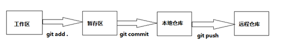

# git使用

### 工作区、暂存区、本地仓库、远程仓库

##### 概念

- 工作区：工作区就是你克隆项目到本地后，项目所在的文件夹目录。

- 暂存区：用于存储工作区中添加上来的变更（新增、修改、删除）的文件的地方。操作时，使用git add .会将本地所有新增、变更、删除过的文件的情况存入暂存区中。

- 本地仓库：用于存储本地工作区和暂存区提交上来的变更（新增、修改、删除）过的文件的地方。操作时，使用git commit –m “本次操作描述” 可以将添加到暂存区的修改的文件提交到本地仓库中。

- 远程仓库：简单来说，就是我们工作过程中，当某一个人的开发工作完毕时，需要将自己开发的功能合并到主项目中去，但因为功能是多人开发，如果不能妥善保管好主项目中存储的代码及文件的话，将会存在丢失等情况出现，所以不能将主项目放到某一个人的本地电脑上，这时就需要有一个地方存储主项目，这个地方就是我们搭建在服务器上的git远程仓库，也就是在功能开始开发前，每个人要下载项目到本地的地方。操作时，使用git push origin 分支名称，将本次仓库存储的当前分支的修改推送至远程仓库中的对应分支中。

##### 关系



   从上图可以看到，我们如果想将在本地工作区中修改，推送到远程仓库的话，需要将工作区的修改的内容，添加到暂存区，再将暂存区的内容提交到本地仓库，最终将本地仓库的内容推送至远程仓库，才能达到最终想要将本地修改推送到远程仓库的目的。

##### 分支

1.   首先，我们要明确一个概念，什么是分支？

简单来说，就是我们工作过程中，要开发一个系统，这个系统会由若干个功能组成，我们将若干个功能交由多个人进行开发。每个人在开发之前，都会将项目从远程仓库下载到本地，然后才能在本地进行对应功能的代码编写。

此时，每个人就可以看作是一个分支。

每个人在其分支中进行着功能开发，最终开发完毕后，需要将开发的功能代码推送到远程仓库进行代码合并，远程仓库中才能有我们开发的功能。

2.   如何使用

在本地仓库中，可以创建多个分支，在多个分支中进行不同的功能开发，来满足业务需求。

在开发完功能后，为了保证本地仓库推送到远程仓库的功能代码，不会出现将其他人开发的功能代码覆盖的情况，需要在每次使用git push origin 分支名称 命令将当前分支中，在本地仓库改动推送到远程仓库之前，需要先将远程仓库的主干分支master的最新代码拉取到本地当前分支的本地仓库中，再进行推送操作，从而保证最终推送本地仓库代码到远程仓库时，推送的代码是完整的（即包含其他人提交的功能的）。

> 注意：开发过程中，必须创建自己分支进行功能开发，不允许直接在master分支中进行功能开发、修改、删除等操作。以免误操作或操作出错等情况出现，污染了远程仓库的主干分支master，导致功能代码无法继续使用，也会影响到其他人的使用。
>


### 基本操作

#### git config

```bash
$ git config --global push.default matching
# 或者
$ git config --global push.default simple
# 修改默认主机
$ git config --list # 查看配置
$ git config --global user.name "maxsu" #可以不用global
$ git config --global user.email "yiibai.com@gmail.com"
$ git config --global core.editor emacs #配置编缉器
$ git config --global merge.tool vimdiff # 配置比较工具

$ git config [–local|–global|–system] –add section.key value
$ git config -–add site.name yiibai # 添加配置
$ git config --local -–unset site.name #删除配置
$ git config --global alias.c 'commit -m'#创建别名 c == commit -m
```


#### git clone

```bash
$ git clone 'url' 'dirName' # 克隆项目+本地项目名称
# url 可以是SSh/git/http[s]/ftp[s]/rsync
$ git clone -o #加-o可以指定其他主机名
# 创建一个裸存储库以将您的更改发布给公众
$ git clone --bare -l /home/proj/.git /pub/scm/proj.git
#现有本地目录借用从上游克隆
$ git clone --reference /git/linux.git 
  git://git.kernel.org/pub/scm/.../linux.git 
    mydir
```

#### git branch

分支操作

```bash
$ git branch  # 查看分支
$ git branch 分支名 # 新建分支
$ git branch -a #查看所有分支，包括本地分支和远程分支
$ git branch -r  # 查看所有远程分支
$ git branch -vv # 查看本地分支与远程分支的映射关系
$ git branch -u origin/远程分支
$ git branch --set-upstream-to origin/远程分支
# 以上两个建立当前分支与远程分支的映射关系（通常建立关系后再拉去文件）git pull 拉取成功和修改后 git push 推送文件
$ git branch --unset-upstream # 撤消本地分支与远程分支的映射关系
$ git branch -d 本地分支名 #删除本地分支
$ git branch -d -r 分支名 #删除远程分支，删除后还需推送到服务器
# 或者 git push origin:<branchname>  #删除后推送至服务器
$ git branch -m <oldbranch> <newbranch> #重命名本地分支
```

```
-d ==> --delete:删除
-f ==> --force:强制
-D ==> --delete --force
-m ==> --move:移动或重命名
-M ==> --move --force
-r ==> --remote:远程
-a ==> --all:所有
```


#### git fetch

##### FETCH_HEAD：

> 某个branch在服务器上的最新状态。每一个执行过fetch操作的项目,都会存在一个FETCH_HEAD列表, 这个列表保存在 .git/FETCH_HEAD 文件中, 其中每一行对应于远程服务器的一个分支. 当前分支指向的FETCH_HEAD, 就是这个文件第一行对应的那个分支。
>

将远程仓库的分支及分支最新版本代码拉取到本地(只是到本地仓库不会合并当前分支)

```bash
$ git fetch # 创建并根系本地远程分支。（如果设置中当前分支-origin/当前分支；则merge的时候origin/abc将合并到abc上）
$ git fetch <origin远程主机名> # 某个远程主机的更新全部取回本地
#手动指定要fetch的remote。在不指定通常为master
$ git fetch origin 远程分支名:本地分支名 
# 创建本地分支，并将远程分支下载到本地分支，（但需要checkout切换分支，不会建立映射关系）
$ git fetch <origin远程主机名> 分支名（dev） #取回origin主机的dev分支。
# 指定远程remote和FETCH_HEAD，并且只拉取该分支的提交。
```

#### git remote

```bash
$ git remote #列出所有远程主机 
$ git remote -v #可以查看远程主机的网址
$ git remote show 主机名 # 查看主机的详细信息
$ git remote add 主机名 网址 # 添加远程主机
$ git remote rm 主机名 #删除远程主机
$ git remote rename 原名 新名 # 修改远程主机名
```


#### git pull

```bash
$ git pull #更新远程分支（可以认为是git fetch+git merge)
$ git pull <远程主机名> <远程分支名>:<本地分支名> # 远程分支是与当前分支合并
# 取回远程主机某个分支的更新，再与本地的指定分支合并。
$ git pull --rebase <远程主机名> <远程分支名>:<本地分支名>
# 如果远程主机删除了某个分支，默认情况下，git pull 不会在拉取远程分支的时候，删除对应的本地分支。这是为了防止，由于其他人操作了远程主机，导致git pull不知不觉删除了本地分支。
# 使用-p解决
$ git pull -p
# 等同于下面的命令
$ git fetch --prune origin 
$ git fetch -p
```


#### git push

```bash
$ git push <远程主机名> <本地分支名>:<远程分支名>
$ git push origin master
# 本地的master分支推送到origin主机的master分支。如果后者不存在，则会被新建。
$ git push origin #将当前分支推送到origin主机
$ git push origin :master
# 等同于
$ git push origin --delete master
$ git push -u origin master #-u指定一个默认主机
$ git push --all origin #将本地的所有分支都推送到远程主机
$ git push --force origin # 强制推送
$ git push origin --tags # 把tag也推送（默认不推）
```


#### git checkout

```bash
$ git checkout '分支名称' # 切换分支
$ git checkout -b '分支名称' 
#切换到新的分支 相当于git branch 新分支名称 和 git checkout 新分支名称两句命令合并在了一起
$ git checkout -b 本地分支名 origin/远程分支名
# 拉取远程分支，在远程分支的基础上创建并切换到本地分支（会建立映射关系）
# git checkout （+tab键、看现有分支进行选择切换）
```

#### git diff 

```bash
$ git diff # 默认比较工作区与暂存区 
$ git diff <file> # 比较当前文件和暂存区文件差异 git diff
$ git diff <id1><id1><id2> # 比较两次提交之间的差异
$ git diff <branch1> <branch2> # 在两个分支之间比较
$ git diff --staged # 比较暂存区和版本库差异
$ git diff --stat # 仅仅比较统计信息
$ git diff --cached [<path>...] #比较本地最新暂存区与最新本地版本库
$ git diff --cached [<commit-id>] [<path>...] #比较暂存区与指定commit-id的差异

$ git diff HEAD [<path>...]# 比较工作区与最新本地版本库,HEAD指向的是master分支
$ git diff HEAD -- file # 比较的是工作区中的文件与版本库中文件的差异。
$ git diff commit-id [<path>...] # 比较工作区与指定commit-id的差异
$ git diff [<commit-id>] [<commit-id>] # 比较两个commit-id之间的差异
```

###### 制作补丁

`git diff`还可以制作补丁文件，在其他机器上对应目录下使用 `git apply patch` 将补丁打上即可 

1. `git diff > patchpatch`的命名是随意的，不加其他参数时作用是当我们希望将我们本仓库工作区的修改拷贝一份到其他机器上使用 
2. `git diff --cached > patch`是将我们暂存区与版本库的差异做成补丁　　　　　 
3. `git diff --HEAD > patch`是将工作区与版本库的差异做成补丁 
4. `git diff filename > patch`将单个文件做成一个单独的补丁

`git apply patch` 应用补丁。 
应用补丁之前我们可以先检验一下补丁能否应用，`git apply --check patch` 如果没有任何输出，那么表示可以顺利接受这个补丁。 

使用`git apply --reject patch`将能打的补丁先打上，有冲突的会生成.rej文件，此时可以找到这些文件进行手动打补丁。

```bash
$ git merge FETCH_HEAD # 将拉取下来的最新内容合并到当前所在的分支中
$ git merge 本地分支名 #合并本地分支到本地master分支
#或者 $ git rebase origin/master
```

#### git init 项目初始化

#### git add

```bash
$ git add .[file_mame,file_mame]
#将修改提交到缓存区中(.是全部，逗号隔开是多个文件)
$ git add documentation/*.txt
$ git add git-*.sh
$ git add *Controller   # 将以Controller结尾的文件的所有修改添加到暂存区
$ git add Hello*   # 将所有以Hello开头的文件的修改添加到暂存区 例如:HelloWorld.txt,Hello.java,HelloGit.txt ...
$ git add Hello?   # 将以Hello开头后面只有一位的文件的修改提交到暂存区 例如:Hello1.txt,HelloA.java 如果是HelloGit.txt或者Hello.java是不会被添加的
```


#### git commit 

```bash
$ git commit –m “本次提交描述”
$ git commit –am “本次提交描述” 或 git commit –a –m“本次提交描述” # 相当于 git add . + git commit -m
# 通过使用--interactive或--patch选项与git commit命令一起确定除了索引中的内容之外哪些文件或hunks应该是提交的一部分，然后才能完成操作。
```

#### git reset

```bash
$ git reset --soft [HEAD^]  #回滚最近一次提交（清除索引和工作区中被搞乱的东西）
$ git reset --hard HEAD~3  #删除最近3次
$ git reset --merge ORIG_HEAD # 避免在回滚时清除工作区
$ git reset --hard ORIG_HEAD #回滚刚才的merge操作
```

#### git rm删除

```bash
$ git rm text1.txt #文件
$ git rm -r mydir #文件夹
$ git rm Documentation/\*.txt #所有txt文件
$ git rm -f git-*.sh 
```


#### git log

```bash
$ git log # 查看所有分支提交历史(-n 表示显示多少条记录)
$ git log --no-merges # 过滤merge操作的历史记录
$ git log --merges #只显示merges历史记录
$ git log -p FETCH_HEAD # 返回某个branch的最新状态
$ git log --stat # 查看提交合并历史记录中每一次提交更新时的文件修改统计情况
$ git log 文件名 #查看某一个文件的提交历史记录(-p 使用路径且是绝对路径)
$ git log --abbrev-commit #缩短版本号到7位
$ git log --before(until) date(2018/11/17) # 在指定日期之前提交历史记录
$ git log --after(since) date #指定日期之后
$ git log --after date --before date # 日期之间
$ git log --relative-date #好像是8小时之前
```


#### git status  命令用于显示工作目录和暂存区的状态

```bash
$ git status [<options>…] [--] [<pathspec>…]
# Edit hello.py
$ git status
# hello.py is listed under "Changes not staged for commit"
$ git add hello.py
$ git status
# hello.py is listed under "Changes to be committed"
$ git commit
$ git status
# nothing to commit (working directory clean)
```


#### git tag  查看版本号 

```bash
$ git tag #查看版本好
$ git tag -a v1.4 -m 'my version 1.4' #添加版本号并且添加注释
$ git tag -d v1.0 #删除标签
$ git tag -v [tag-name] #验证标签
# 可以通过push分享标签
```

#### git show

```bash
$ git show v1.0.0 #显示标签v1.0.0，以及标签指向的对象
$ git show v1.0.0^{tree}#显示标签v1.0.0指向的树
$ git show -s --format=%s v1.0.0^{commit} #显示标签v1.0.0指向的提交的主题
$ git show next~10:Documentation/README#显示 Documentation/README 文件的内容，它们是 next 分支的第10次最后一次提交的内容
$ git show master:Makefile master:t/Makefile #将Makefile的内容连接到分支主控的头部
```


### Git和gitHub建立SSH连接 

##### 第一步：检查已有的SSH keys

```bash
$ ls -al ~/.ssh
```

##### 第二步：生成新的SSH key

```bash
$ ssh-keygen -t rsa -C "your_email@example.com"
# Creates a new ssh key, using the provided email as a label
# Generating public/private rsa key pair.
# Enter file in which to save the key (/c/Users/you/.ssh/id_rsa): [Press enter]
Enter passphrase (empty for no passphrase): [Type a passphrase]
# Enter same passphrase again: [Type passphrase again]
```

接着会得到如下的提示：

```bash
Your identification has been saved in /c/Users/you/.ssh/id_rsa.
# Your public key has been saved in /c/Users/you/.ssh/id_rsa.pub.
# The key fingerprint is:
# 01:0f:f4:3b:ca:85:d6:17:a1:7d:f0:68:9d:f0:a2:db your_email@example.com
```

然后将这个新的key添加到ssh-agent中：

```bash
$ ssh-agent -s
# Agent pid 59566
$ ssh-add ~/.ssh/id_rsa
```

***注： 如果执行 ssh-add 时显示错误 Could not open a connection to your authentication agent. 那么执行**

```bash
eval `ssh-agent -s`	
```

后重新执行 `ssh-add` 那条命令即可。

##### 第三步：将SSH key添加到你的GitHub账户

```bash
$ clip < ~/.ssh/id_rsa.pub  # 复制
# Copies the contents of the id_rsa.pub file to your clipboard
```

##### 第四步：检查SSH key是否成功设置

```bash
$ ssh -T git@github.com
# Attempts to ssh to GitHub
```

可能会看到如下的警告：

```bash
The authenticity of host 'github.com (207.97.227.239)' can't be established.
# RSA key fingerprint is 16:27:ac:a5:76:28:2d:36:63:1b:56:4d:eb:df:a6:48.
# Are you sure you want to continue connecting (yes/no)?
```

输入“yes”，如果得到下面的结果，说明你的设置是成功的！

```bash
Hi username! You've successfully authenticated, but GitHub does not
# provide shell access.
```

### SSH连接注意：

1. 设置完SSH记得设置global
2. 重新连接的时候记得使用 `ssh-agent  -s` 和 `ssh-add ~/.ssh/id_rsa`  然后输入设置的密钥密码进行链接
3. 报错就 `eval 'ssh-agent -s'`  转化为对象然后重新 ssh-add 进行链接

pull Request

